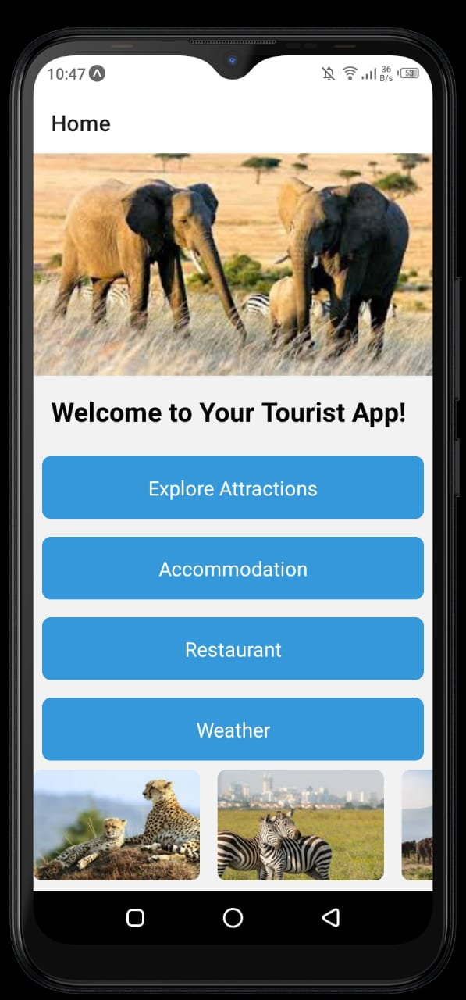
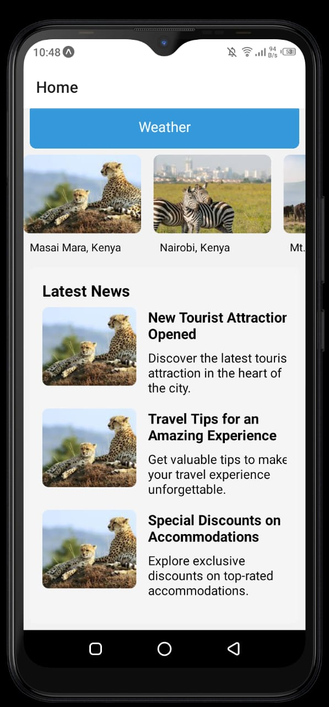
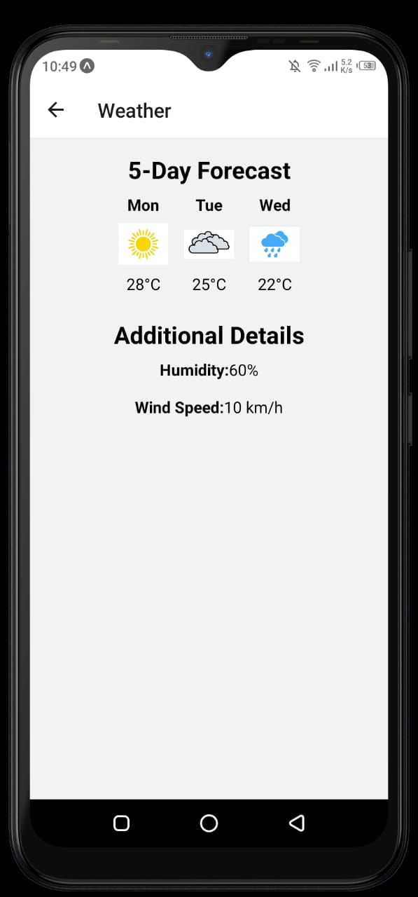
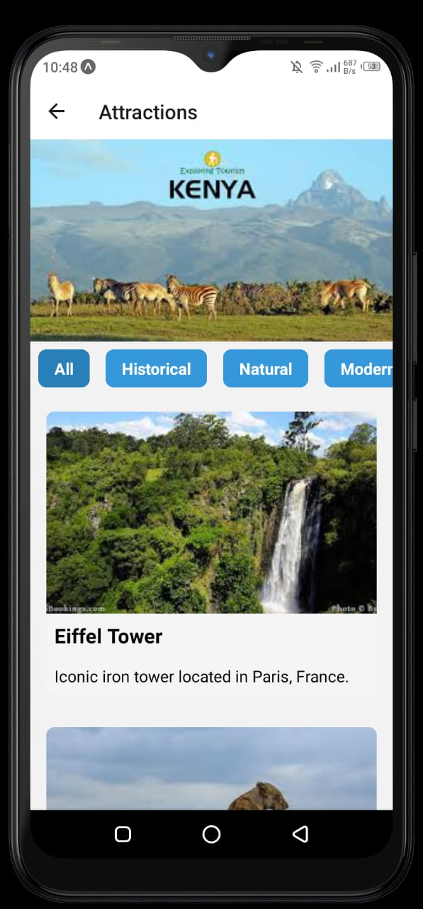
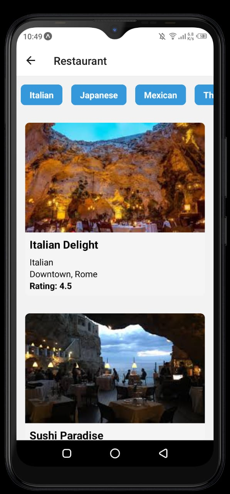
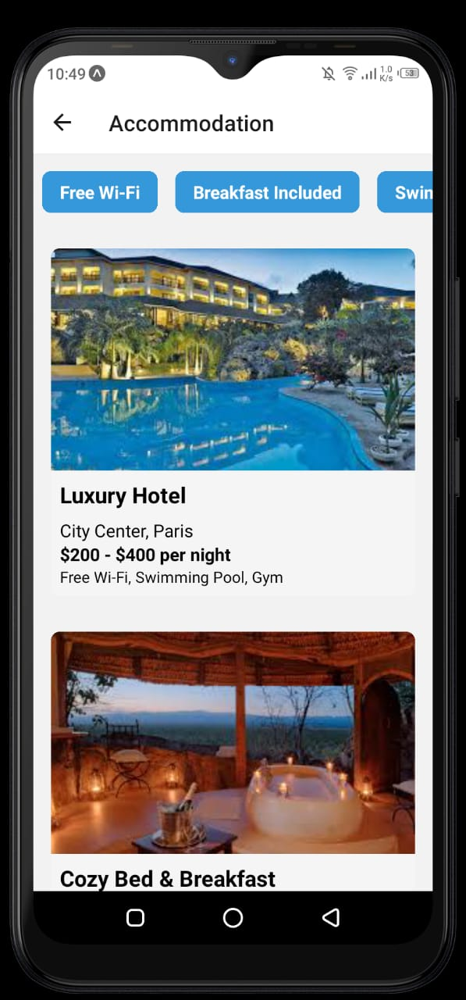
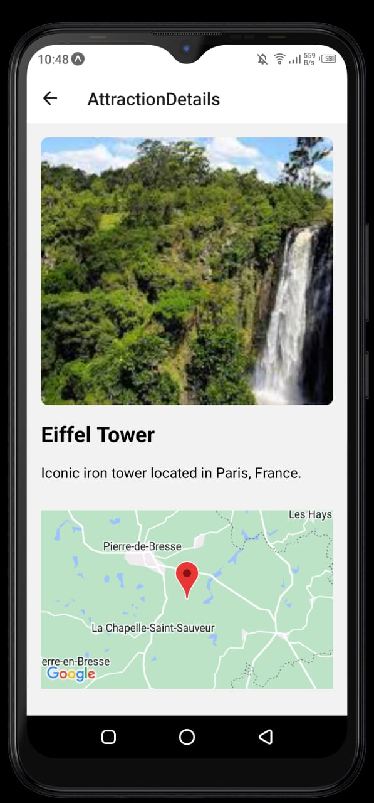

# Tourist App Overview:

The Tourist App is a mobile application designed to enhance the travel experience for users. It covers various aspects of travel planning, exploration, and engagement. The app offers a user-friendly interface with multiple screens dedicated to different functionalities.

# Key Features:

@ Home Screen:

Welcome screen with a visually appealing design.
Quick access to essential features such as Weather, Attractions, Restaurants, Accommodations, and Map Integration.

@ Weather Screen:

Real-time weather information for the user's selected city.
5-day weather forecast, providing insights into upcoming conditions.
Additional weather details like humidity, wind speed, etc.

@Attractions Screen:

A curated list of attractions based on the user's location or selected city.
Detailed information about each attraction, including images, descriptions, and user reviews.
Categories for filtering attractions, improving user navigation.

@Restaurants Screen:

An extensive list of restaurants with details such as cuisine type, location, and user ratings.
Filters for refining restaurant options based on cuisine preferences.
User-friendly interface with an appealing design.

@Accommodation Screen:

Displays available accommodations with key details like name, location, and amenities.
Filtering options for refining accommodation choices based on user preferences.
Clear and organized presentation for a seamless user experience.

@Map Integration:

Integration of a map to provide a visual representation of attractions, restaurants, and accommodations.
Allows users to explore the geographical layout of their chosen destination.

@Attraction Details Screen:

In-depth information about a specific attraction, including user reviews and comments.
Integration with the map to visualize the attraction's location.

@Review and Comment Section:

Users can submit reviews and comments for attractions, creating an interactive community aspect.
The ability to share personal experiences and recommendations.

@Technology Stack:

Developed using React Native for cross-platform compatibility.
Utilizes Expo for streamlined development and additional features.
Integration with third-party APIs, such as OpenWeatherMap, for real-time weather data.

# Installation of dependancies

@ Navigation 
npm install @react-navigation/native @react-navigation/stack

@ ReactMap
npx expo install react-native-maps

@vectore icons
npm install react-native-vector-icons

npm install axios

# installing Expo in your project
sudo npm install -g expo-cli

@backend
npm init -y
npm install express nodemailer

# Install eas and build apk
sudo npm install -g eas-cli
eas build -p android

# Alt
 eas build:configure 
 eas build -p android --profile preview
